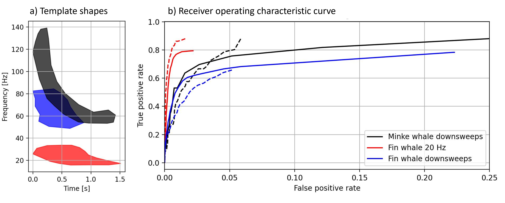

Scripts and data relating to the paper "Acoustic propagation modelling and automatic detection of baleen whale vocalizations north of the South Orkney Islands"

The newly created python package to screen and annotate the recordings, and autonaticall dtece calls is described here :
https://github.com/sebastianmenze/Python-Audio-Spectrogram-Explorer
It is also available as windows exectuble in the repository. 

The open source python scripts to model the detection range / audible area are described in more detail here:
https://github.com/sebastianmenze/acoustic_recorder_detection_range_modeling

The open source python scripts to process the Aural-M2 data are decsribe in more detail here:
https://github.com/sebastianmenze/Analyzing-ambient-sound-recordings-from-Aural-M2-recorders-with-python

The shape matching detection algorithm is described in more detail here :
https://github.com/sebastianmenze/Marine-mammal-call-detection-using-spectrogram-shape-matching

